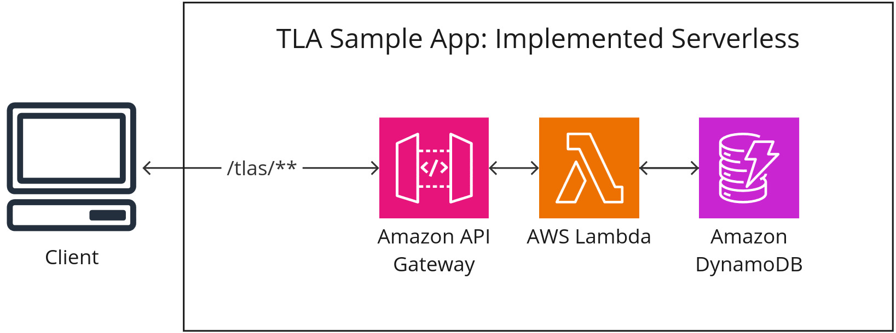
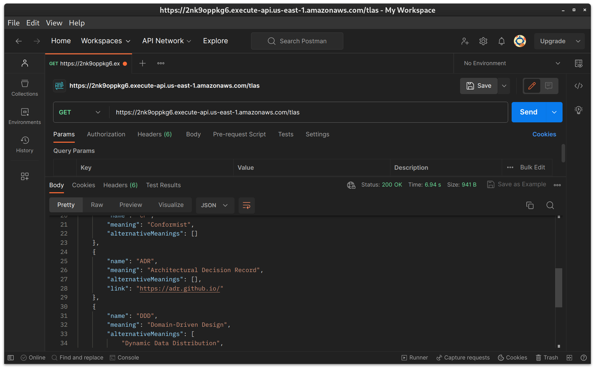

# Three Letter Abbreviations (TLA) Sample Application - Implemented Serverless
[](https://github.com/stefan-ka/tla-sample-serverless/actions/workflows/main_build.yml) [](https://opensource.org/licenses/Apache-2.0)

This repository implements the [Three Letter Abbreviations (TLA) Sample Application](https://github.com/ContextMapper/ddd-cm-tla-sample-application) of the [Context Mapper](https://contextmapper.org) project with serverless technology. It can easily be deployed on AWS. This, admittedly very trivial app, uses the following AWS services:



 * **Amazon API Gateway** now serves the RESTful HTTP API to access the TLA's.
 * **AWS Lambda** is used (one function per endpoint) to process the request events of the API gateway, load the data from a DynamoDB table and return a response event back to the gateway.
 * **Amazon DynamoDB** is used to persist the TLA's.

## Used Technology

The app uses the following tools and frameworks:

 * [Maven](https://maven.apache.org/) to build the app deployable (JAR)
 * [Spring Boot](https://spring.io/projects/spring-boot) and [Spring Cloud Function](https://spring.io/projects/spring-cloud-function) to implement the functions.
 * The [AWS SDK for Java 2.x](https://docs.aws.amazon.com/sdk-for-java/latest/developer-guide/get-started.html) to connect to the DynamoDB.
 * The [Serverless Framework](https://www.serverless.com/) to deploy the whole application on AWS.
   * Including the definition of the API endpoints and the DynamoDB table; see the [serverless.yml](https://github.com/stefan-ka/tla-sample-serverless/blob/main/serverless.yml) file. 
 * [GitHub Actions](https://github.com/stefan-ka/tla-sample-serverless/actions) as CI/CD tool to automatically deploy the app to AWS.

## Build & Deploy the App

Building the app and its JAR file is done with Maven:

```bash
./mvnw clean package
```

Once successfully built, the app is easily deployed with:

```bash
serverless deploy
```

_Note:_ Of course, `serverless deploy` only works if you have already set up the serverless framework locally, including logging in and connecting to your AWS account. See the [Serverless Framework documentation](https://www.serverless.com/framework/docs/getting-started) for more information on how to do this.

Once `serverless deploy` was successfully deployed, you can access the TLA's via the apps API: 🎉



## Contributing
Contributions are always welcome! Here are some ways how you can contribute:
* Create Github issues if you find bugs or just want to give suggestions for improvements.
* This is an open source project: if you want to code,
  [create pull requests](https://help.github.com/articles/creating-a-pull-request/) from
  [forks of this repository](https://help.github.com/articles/fork-a-repo/). Please refer to a Github issue if you
  contribute this way.

## Licence
Context Mapper is released under the [Apache License, Version 2.0](http://www.apache.org/licenses/LICENSE-2.0).
